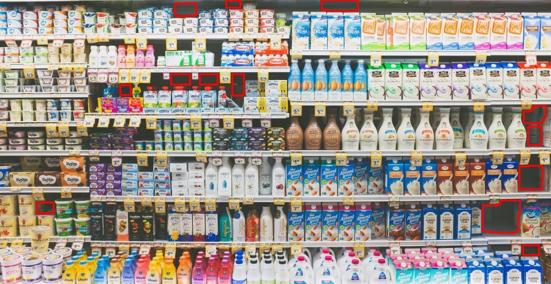

# SmartStockCheck
Smart Automatic Shelves Stock Check 
- Connect Webcam Camera, IP Camera or CCTV.
- Display and analyze amount of product shelves stock.
- Notice when product is empty.

# For Public Ver.
It's a sample result of this project for show what this project can do and interview how this project work 
 and for interview my abilities, skill and experience.

If you interested in this project, You can contact me.

## Environment
- Webcam Camera, IP Camera or CCTV
- Mornitor
- Processor Device (Computer, Laptop or mini computer)

## Work Example
### version_1.x
 - Input
 
 
 - Output
 
 

## Credits

 # Contact 
 - E-Mail : 5735512155@psu.ac.th
 - LinkedIn : https://www.linkedin.com/in/jakgri-klabdi-1b5557183/
